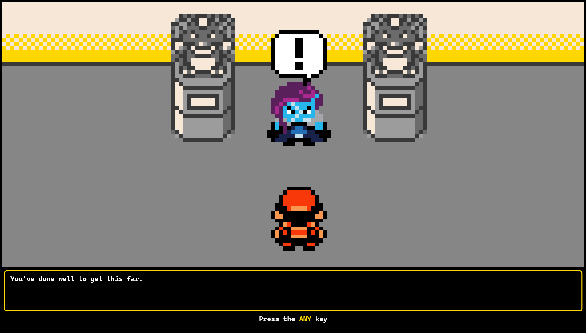

# PwshFromIntimidationToInteraction
PowerShell talk content for https://www.meetup.com/nycpowershellmeetup/events/293491512

> **Warning**  
> The code in this repo follows none of the advice from the presentation because I didn't have time to do things properly when hacking this together over the last few weeks to have it ready for the day 😅  
This has only been tested on Windows in Windows Terminal.

## Prepare Your Terminal for the Presentation

These steps are optional but without them, the visuals will look buggy.

1. Use Windows Terminal.  
2. If you don't have a font like [CaskaydiaCove Nerd Font](https://www.nerdfonts.com/font-downloads) as your active font in Windows terminal, a lot of characters will show up as empty square boxes in the presentation content.
3. A lot of the visual aspects of the presentation use Spectre.Console. To enable all features of Spectre.Console you need to enable Unicode support in your PowerShell profile by adding the following to the top of your profile script. The script can be found at the value in the `$PROFILE` variable in your terminal.  
    ```pwsh
    $OutputEncoding = [console]::InputEncoding = [console]::OutputEncoding = New-Object System.Text.UTF8Encoding
    ```
    See [Spectre.Console best practices](https://spectreconsole.net/best-practices) for more info.

## Run The Presentation
Try running `./Present.ps1` and pray to the demo gods.


