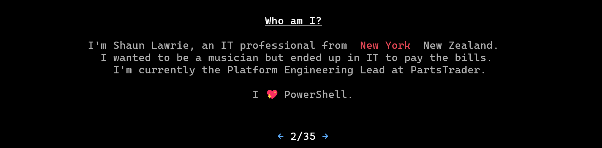
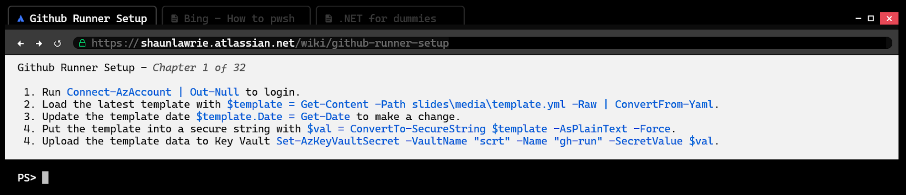
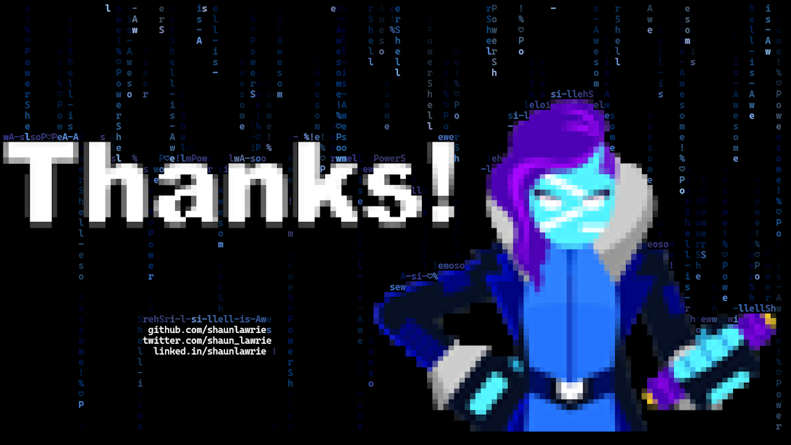
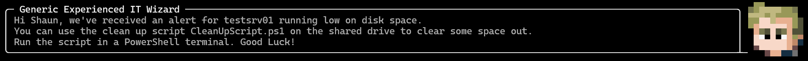
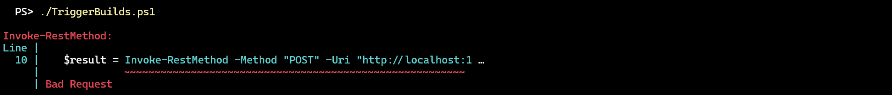

# README

## Quick Forks

These modules are quickly modified to support the presentation and are not representative of the functionality of the real ones. The real modules can be found at:

- PowerShellAI https://github.com/dfinke/PowerShellAI
- PwshSpectreConsole https://github.com/ShaunLawrie/PwshSpectreConsole

## Feedback Providers

These feedback providers are not supported by PowerShell because they're not written in C# and they also require an extended timeout.  
To try them you would need to [build this branch of PowerShell](https://github.com/ShaunLawrie/PowerShell/tree/configurable-feedbackprovider-timeouts) and use the pwsh.exe it provides.  
See https://github.com/PowerShell/PowerShell/issues/19975 for details on why this isn't supported.

## Ad-hoc Modules

During my presentation prep I have hacked together some modules to use during it. The code is terrible because I didn't have the benefit of time.

- **Presentation.psm1**  
  This is used to house most of the controls I created to make it possible to present "slides" inside the terminal.
  

- **Browser.psm1**  
  This is used to draw something that looks like a browser inside the terminal.
  

- **Matrix.psm1**  
  This is used to draw a matrix-like thank-you slide that has the letters fall from the top and collide with terminal cells that contain part of an image or text.
  

- **Pokemon.psm1**  
  This is used to draw pokemon style speech bubbles next to a pixelated avatar.
  

- **PresentationWebServer.psm1**  
  This is used to host a very basic web server during the presentation that I used to send Invoke-RestMethod requests to for an example of dealing with API error responses.
  
